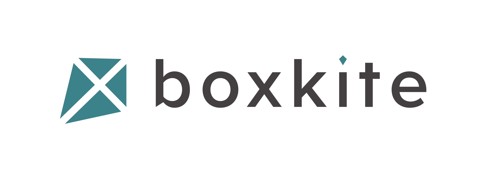
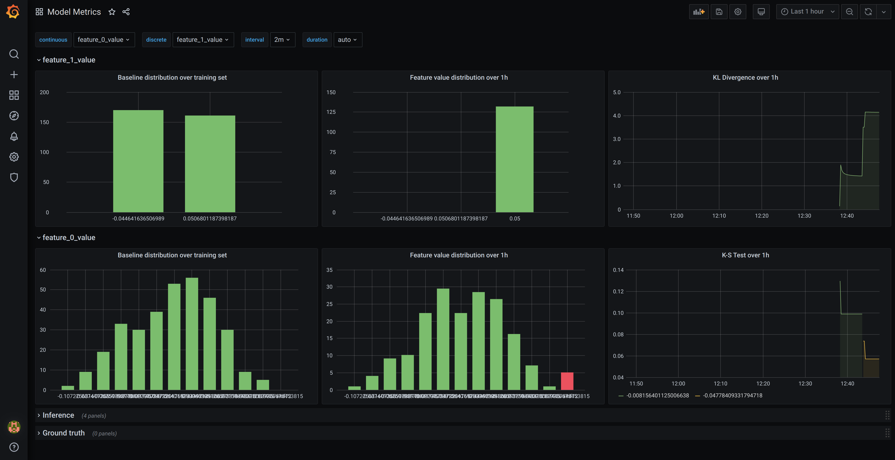

# Easy Open Source ML Monitoring

{: style="width:300px" }

Boxkite makes it easy to monitor ML models in production and integrate into your existing workflows. It aims to be simple, flexible, and reliable.

Boxkite allows easy monitoring of model behavior in production systems by capturing the model training distributions and comparing them against realtime production distributions via Prometheus and Grafana:

Boxkite also includes PromQL queries to calculate divergence metrics, such as [KL Divergence](https://en.wikipedia.org/wiki/Kullback%E2%80%93Leibler_divergence) to give you a measure of _how different_ your production traffic is from your training data. This allows you to capture model and data drift.

## Getting Started

Follow one of our tutorials to easily get started and see how Boxkite works with other tools:

- [Prometheus & Grafana](tutorials/grafana-prometheus.md) in Docker Compose
- [Kubeflow & MLflow](tutorials/kubeflow-mlflow.md) on Kubernetes

See [Installation](installing.md) & [User Guide](using.md) for how to use Boxkite in any environment.

## Contributors

The following people have contributed to the original concept and code

- [Han Qiao](https://github.com/sweatybridge)
- [Nguyen Hien Linh](https://github.com/nglinh)
- [Luke Marsden](https://github.com/lukemarsden)

A full list of contributors, which includes individuals that have contributed entries, can be found [here](https://github.com/basisai/model-monitoring/graphs/contributors).

## Shameless Plug

Boxkite is a project from Basis-AI, who offer an MLOps Platform called Bedrock.

[Bedrock](https://basis-ai.com/product) helps data scientists own the end-to-end deployment of machine learning workflows. Boxkite was originally part of the Bedrock client library, but we've spun it out into an open source project so that it's useful for everyone!
